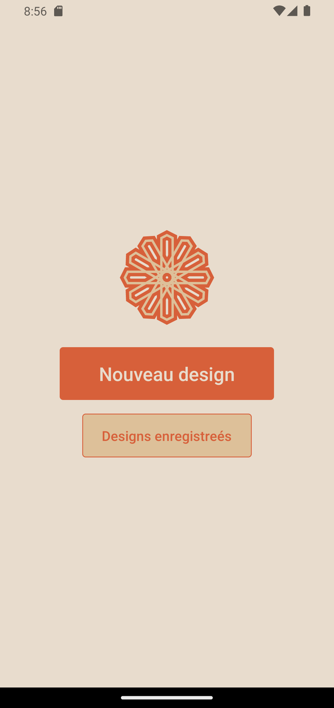
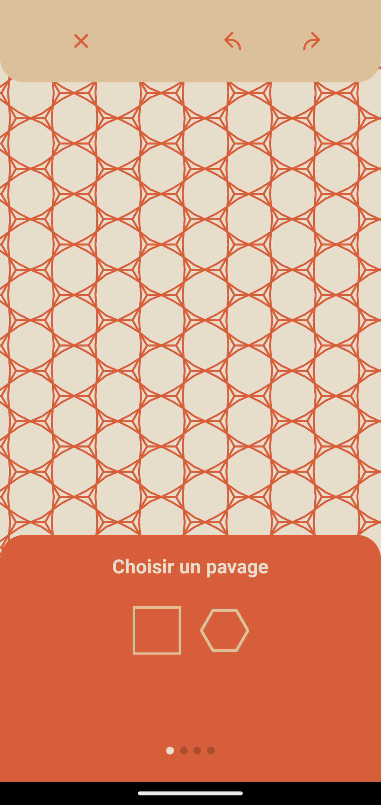
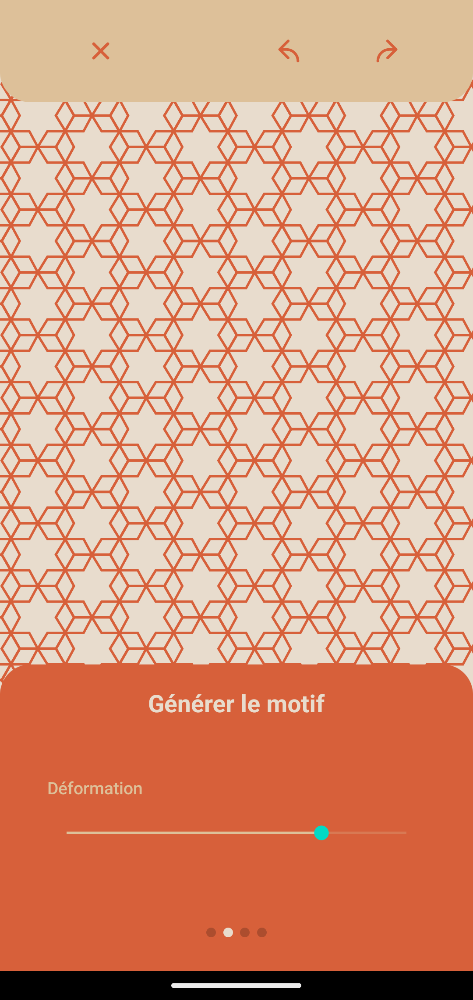
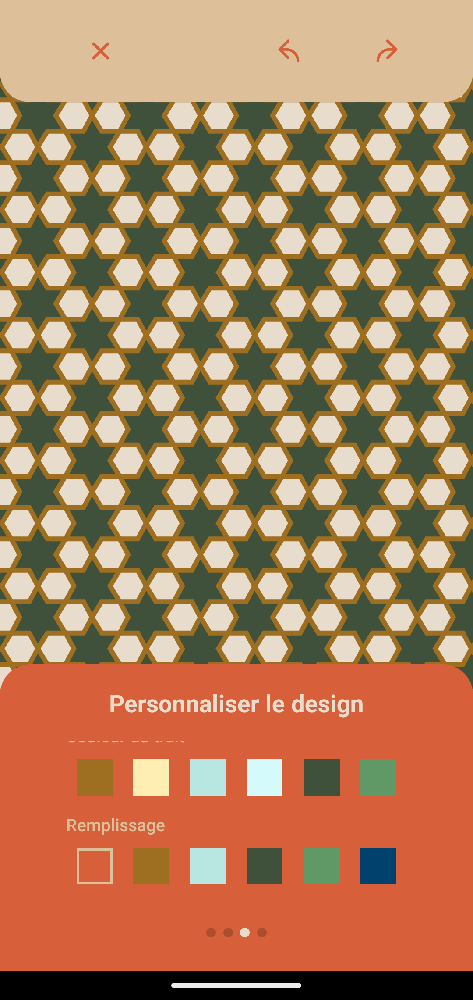

# Final year projet
# **Islamic Geometric Patterns Mobile App 📱**

 

## **Project Description 📜**

Welcome to the Islamic Geometric Patterns mobile app! 🎉 Developed using the powerful React Native framework, our application addresses a common challenge faced by artisans and professionals who lack suitable tools to design and share their intricate geometric Islamic patterns with clients or fellow artisans. Our ultimate goal is to preserve this precious heritage and make it accessible to everyone.

🔹 **Create Stunning Patterns:** With this app, you can easily create beautiful Islamic patterns that you often see adorning mosque entrances and homes.

🔹 **Multiplatform Support:** The app is available for both Android and iOS platforms, thanks to React Native's cross-platform capabilities.

## **Project Building Blocks 🧱**

In our project, we identified React Native as the most promising framework for multiplatform app development. Additionally, we chose SVG (Scalable Vector Graphics) as a relevant library for manipulating and displaying vector graphics.

## **Future Perspectives 🚀**

Although our work is still a work in progress, we have a vision for the future of the Islamic Geometric Patterns app that we would like to share. We've decided to make this project open source on GitHub to invite collaboration and contributions from the community. Here are some of the exciting features we plan to implement:

🔹 **Robust Tiling Generation Methods:** We aim to implement methods that automatically generate tiles, increasing the diversity of available patterns.

🔹 **Faster Tiling Generation:** We recognize that pattern generation can be time-consuming for complex designs. We hope to optimize this process to provide a smoother user experience.

🔹 **More Pattern Generation Methods:** We want to add additional pattern generation methods, such as rosette-shaped patterns, to offer users a wider variety of designs.

🔹 **Customization and Collaboration:** Our ultimate vision is to give users the freedom to personalize their patterns by adding colors, text, borders, and even inserting the pattern into frames to simulate real-world placement. We also aim to create a collaborative space where users can share and collaborate on their own designs.

## **How to Install and Run the Project 🚀**

To install and run the Islamic Geometric Patterns app, follow these steps:

1. Clone the repository to your local machine.
2. Navigate to the project directory.
3. Install the required dependencies using the package manager of your choice.
4. Build and run the app on your device or simulator.

## **Credits, Acknowledgments, and Additional Resources 📚**

We would like to express our gratitude to our mentor, Professor Youssef EL BENANI, for their valuable guidance and support throughout this project.

In the development of the Islamic Geometric Patterns mobile app, we extend our heartfelt appreciation to all the contributors and resources that have inspired and supported us along this journey.

🔹 **Credits and Acknowledgments:**

- E. H. Hankin. "The Drawing of Geometric Patterns in Saracenic Art," volume 15 of Memoirs of the Archaeological Society of India, Government of India, 1925.
- Craig S. Kaplan. "Islamic Star Patterns from Polygons in Contact," 2005.
- Islamic Geometric Patterns: Their Historical Development and Traditional Methods of Construction by Jay Bonner, Craig Kaplan

📚 We also recommend the following resources :

- [Coding Train Islamic Star Patterns](https://youtu.be/hCjTKCb2Cuw)
- [Application for Nets and Tessellations With Edge-to-edge Regular Polygons](https://github.com/HHogg/antwerp)
